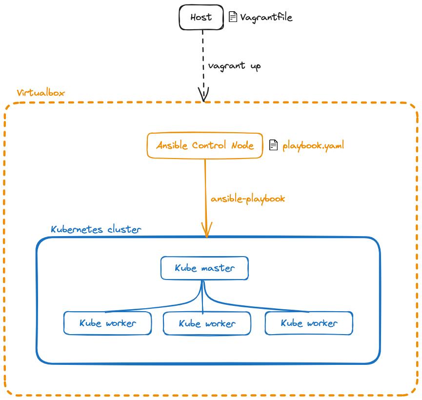

# Automated Kubernetes Cluster Setup using Vagrant and Ansible

## Table of Contents

1. [Prerequisites](#prerequisites)
2. [Setting up the Development Environment](#setting-up-the-development-environment)
3. [Automatically Creating Virtual Machines with Vagrant](#automatically-creating-virtual-machines-with-vagrant)
3. [Configuring a Kubernetes Cluster with Ansible](#configuring-a-kubernetes-cluster-with-ansible)
    - [Ansible Configuration File (ansible.cfg)](#ansible-configuration-file)
    - [Ansible Inventory File (inventory.ini)](#ansible-inventory-file)
    - [Utilizing Ansible Roles](#utilizing-ansible-roles)


## Prerequisites

Before proceeding with the setup, ensure you have the following prerequisites on your host machine:
- **Vagrant** installed: Vagrant helps automate the creation and provisioning of virtual machines.
- **VirtualBox** (or any other Vagrant provider) installed for virtualization capabilities.

## Setting up the development environment

We used Vagrant to create our development environment for this project. Vagrant helps us automate the creation and provisioning of multiple virtual machines from one configuration file: the *Vagrantfile*.

The overall architecture consists of our host machine and five VMs: one for the Ansible Controller Node and four for the Kubernetes cluster (one master and three workers).

### Architecture Overview

The architecture of our setup involves the host machine and five virtual machines:
- Ansible Controller Node (1 VM)
- Kubernetes Cluster (1 Master Node and 3 Worker Nodes)



## Automatically Creating Virtual Machines with Vagrant

Vagrant is a tool for automating the creation and management of virtual machines. It relies on providers like VirtualBox to leverage their virtualization capabilities and simplifies the setup process.

In the Vagrantfile, we define two types of nodes:
- *controller* nodes refers to the Ansible Control Node,
- *worker* nodes are part of the Kubernetes cluster.

Both types of nodes share similar OS distribution and general resources such as CPUs and memory. Additionally, they are configured to be in the same private network to facilitate communication. For the controller node, Ansible is installed using a shell provisioner.

### Setting up SSH communication between our VMs

To set up SSH communication between the VMs, we ensure the controller's SSH public key is shared with the worker nodes. This allows the controller to remotely configure the worker nodes.

The following snippets illustrate the SSH setup process in the Vagrantfile:

#### Controller node

```ruby
# Vagrantfile
node.vm.provision "shell", inline: <<-SHELL

 # These lines follow the installation of Ansible

 # Creates .ssh directory with proper owner, group and permissions
 mkdir -p /home/vagrant/.ssh
 chown -R vagrant:vagrant /home/vagrant/.ssh
 chmod 700 /home/vagrant/.ssh
 chmod 600 /home/vagrant/.ssh/authorized_keys

 # Generates a 4096-bit RSA key
 yes | ssh-keygen -t rsa -b 2048 -f /home/vagrant/.ssh/id_rsa -q -N ""

 # Copies the key on the host machine
 cat /home/vagrant/.ssh/id_rsa.pub > /vagrant/controller#{i}_pubkey

 # Restarts the SSH daemon just in case
 systemctl restart sshd

SHELL
```

#### Worker nodes

Finally, in the workers' script, we add the controller's public key to their *authorized_keys*:

```ruby
# Vagrantfile
node.vm.provision "shell", inline: <<-SHELL
  # These lines follow the software update

  # Creates a .ssh directory with proper owner, group and permissions
  mkdir -p /home/vagrant/.ssh

  # Adds the controller1's public key to the worker's authorized keys
  cat /vagrant/controller1_pubkey >> /home/vagrant/.ssh/authorized_keys

  chown -R vagrant:vagrant /home/vagrant/.ssh
  chmod 700 /home/vagrant/.ssh
  chmod 600 /home/vagrant/.ssh/authorized_keys

  # Restarts the SSH daemon just in case
  systemctl restart sshd
SHELL
```

To enhance our working environment, we share the project's repository with our controller
node:

```ruby
node.vm.synced_folder "./provisioning", "/home/vagrant/workstation"
```
By synchronizing the "provisioning" directory with "/home/vagrant/workstation" on the controller node, we can easily access and manage our Ansible playbooks and configuration files.

## Configuring a Kubernetes cluster with Ansible

Ansible is an open-source automation tool that efficiently configures, manages, and deploys applications and infrastructure. To customize Ansible's behavior, we use configuration files.

### Ansible configuration file

```cfg
# ansible.cfg
[defaults]
inventory=/home/vagrant/inventory.ini            # Specify the location of the inventory file
host_key_checking=False                          # Disable confirmation prompt during remote host connection
ask_pass=False                                   # Disable password authentification
remote_user=vagrant                              # Set default remote user to "vagrant"

[privilege_escalation]
become=True                                      # Enable privilege escalation
become_method=sudo                               # Specify privilege escalation method to "sudo"
become_user=root                                 # Set superuser to "root"
become_ask_pass=False                            # Disable password authentication for root
```

### Ansible inventory file

The inventory file specifies the hosts and groups that Ansible will manage during playbook execution. We dynamically generate this file in the [Vagrantfile](./Vagrantfile) to ensure it always contains the IP addresses of the virtual machines, irrespective of the number of nodes provisioned.

```ini
# inventory.ini
[kubemasters]
kubemaster1 ansible_host=192.168.56.4
[kubeworkers]
kubeworker1 ansible_host=192.168.56.5
kubeworker2 ansible_host=192.168.56.6
kubeworker3 ansible_host=192.168.56.7
```

### Utilizing Ansible Roles

Ansible roles organize and package automation tasks, variables, and configurations into a reusable unit. By breaking down the Kubernetes cluster setup into roles, it becomes easier to manage and update specific components or configurations independently, promoting consistency and simplifying deployment across different environments.

To start, we define two roles, corresponding to our inventory groups:
- *kubemaster* installs Docker, configure Kubernetes core components, Calico network, and generates the join command for worker nodes to join the cluster.
- *kubeworker* installs Docker and joins the worker nodes to the Kubernetes cluster.

```markdown
.
├── common_tasks
├── k8s_master
└── k8s_worker
```
The *common_tasks* directory will store tasks that are common to both kubemaster and kubeworker roles.

#### Kubemaster Role Structure:

We begin by generating the Kubemaster role using the ```ansible-galaxy init``` command, which sets up the following folder structure. We will add our tasks to the *tasks* directory.

The tasks/main.yml file orchestrates the different subtasks in the following order:

```markdown
---
- name: Setup Docker
  include_role:
    name: common
    tasks_from: docker_setup

- name: Setup Kubernetes
  include_role:
    name: common
    tasks_from: kubernetes_setup

- name: Initialize Kubernetes cluster
  include_tasks: init_kubernetes_cluster.yml

- name: Calico network setup
  include_tasks: calico_setup.yml

- name: Generate join command and copy to local file
  include_tasks: join_command.yml
```

#### Kubeworker role

```markdown
---
- name: Setup Docker
  include_role:
    name: common
    tasks_from: docker_setup

- name: Setup Kubernetes
  include_role:
    name: common
    tasks_from: kubernetes_setup

- name: Configure node ip
  include_tasks: configure_node.yml

- name: Join command
  include_tasks: join_command.yml
```

## Resources

- [Vagrant for beginners, a tutorial](https://dev.to/kennibravo/vagrant-for-beginners-getting-started-with-examples-jlm)
- [Setting a Kubernetes cluster with Ansible](https://vrukshalitorawane.medium.com/kubernetes-setup-with-wordpress-using-ansible-48dea03dc339)
