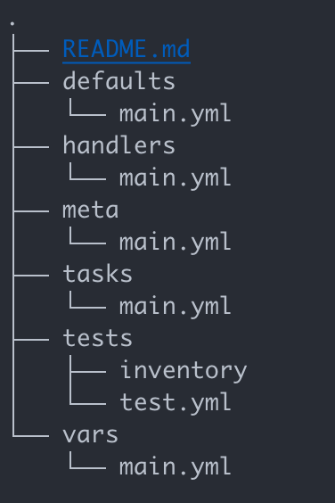

# Prerequisites

To run this project, you will need Vagrant installed on your host machine.

# Setting up our development environment

We used Vagrant to create our development environment for this project. Vagrant helps us automate the creation and provisioning of multiple virtual machines from one configuration file: the *Vagrantfile*.

The overall architecture consists of our host machine and five VMs: one for the Ansible Controller Node and four for the Kubernetes cluster (one master and three workers).

Overview of the architecture
-


## Creating Virtual Machines automatically with Vagrant

Vagrant is a tool for automating the creation and management of virtual machines. It relies on providers like VirtualBox to leverage their virtualization capabilities and simplifies the setup process.

In the Vagrantfile, we define two types of nodes:
- *controller* nodes refers to the Ansible Control Node,
- *worker* nodes are part of the Kubernetes cluster.

Both types of nodes share similar OS distribution and general resources such as CPUs and memory. There are also configured to be in the same private network. For the controller node, Ansible is installed using a shell provisioner. 

## Setting up SSH communication between our VMs

To enable a remote configuration the worker nodes from the controller, we establish SSH communication by sharing the controller's SSH public key with the workers.

We update the controller's script as follows:

```bash
node.vm.provision "shell", inline: <<-SHELL
  # These lines follow the installation of Ansible

  # Creates a .ssh directory with proper owner, group and permissions
  mkdir -p /home/vagrant/.ssh
  chown -R vagrant:vagrant /home/vagrant/.ssh
  chmod 700 /home/vagrant/.ssh
  chmod 600 /home/vagrant/.ssh/authorized_keys

  # Generates a 4096-bit RSA key (as per ANSSI recommendations :nerd_face:)
  yes | ssh-keygen -t rsa -b 2048 -f /home/vagrant/.ssh/id_rsa -q -N ""

  # Copies the key on the host machine
  cat /home/vagrant/.ssh/id_rsa.pub > /vagrant/controller#{i}_pubkey

  # Disables Ansible host key checking
  echo "export ANSIBLE_HOST_KEY_CHECKING=False" >> /home/vagrant/.bashrc
  source /home/vagrant/.bashrc

  # Restarts SSH daemon just in case
  systemctl restart sshd
SHELL
```

Finally, in the workers' script, we add the controller's public key to their *authorized_keys*:

```bash
node.vm.provision "shell", inline: <<-SHELL
  # These lines follow the software update

  # Creates a .ssh directory with proper owner, group and permissions
  mkdir -p /home/vagrant/.ssh

  # Adds the controller1's public key to the worker's authorized keys
  cat /vagrant/controller1_pubkey >> /home/vagrant/.ssh/authorized_keys

  chown -R vagrant:vagrant /home/vagrant/.ssh
  chmod 700 /home/vagrant/.ssh
  chmod 600 /home/vagrant/.ssh/authorized_keys

  # Restarts SSH daemon just in case
  systemctl restart sshd
SHELL
```

## Structuring our repository

Before we start configuring our Kubernetes cluster with Ansible, 

### Folder structure

We followed the directory structure presented in the Vagrant documentation[^1],
namely:



[^1]: https://developer.hashicorp.com/vagrant/docs/provisioning/ansible_intro

### CI/CD ?

- precommit lint and yaml checker

//TODO: see Ansible and Vagrant test modules

### Share folder

To improve our working environment, we share the repository to our controller
node.

```ruby
node.vm.synced_folder "./provisioning", "/home/vagrant/workstation"
```

We are ready !

# Configuring a Kubernetes cluster with Ansible

## Ansible configuration file

- we can remove our environment variable in the vagrant file for ansible host
  key checking

## Inventory file

cat the file 

make schema of the kubernetes cluster

## Ansible roles

We will create 4 different roles:

- k8s master
- k8s worker
- wordpress
- ec2

```bash
ansible-galaxy init <role_name>
```
## Basic installation

To set up our Kubernetes cluster, let's install Kubernetes on all the worker
VMs.

## Kube master

## Kube workers
# Resources

- [Vagrant for beginners, a tutorial](https://dev.to/kennibravo/vagrant-for-beginners-getting-started-with-examples-jlm)
- [Setting a Kubernetes cluster with Ansible](https://vrukshalitorawane.medium.com/kubernetes-setup-with-wordpress-using-ansible-48dea03dc339)

